🟢 &nbsp;you've joined <b>arnavsao's server</b> — currently viewing <code>#readme</code> &nbsp;·&nbsp; 🐉 the dragon has taken over your cursor

  

  

<h3><code>#</code> tech-stack</h3>

  

<h3><code>#</code> contribution-activity</h3>

  

watch the profile card — a cursor flies in, hovers, and turns into a dragon 🐉 
refreshed daily by a GitHub Action · <a href="https://arnavsao-portfolio.vercel.app">arnavsao-portfolio.vercel.app</a>

